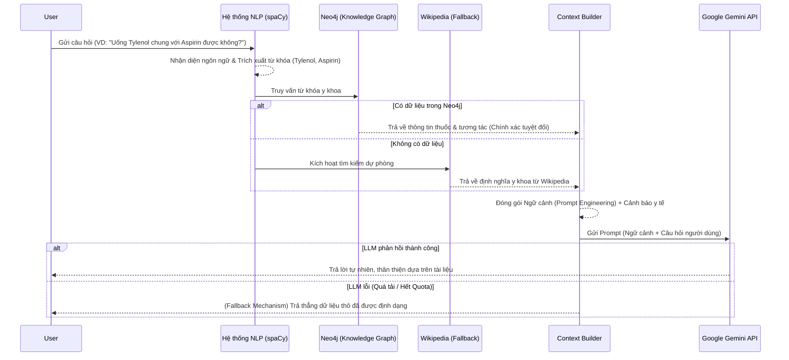

# Nguyên Lý Hoạt Động Của Hệ Thống AI (Medical Chatbot)

Nguyên lý hoạt động của AI trong hệ thống Medical Chatbot này được xây dựng dựa trên kiến trúc **RAG (Retrieval-Augmented Generation - Thế hệ tăng cường truy xuất)**. 

Thay vì để AI (Google Gemini) tự do trả lời theo trí nhớ (dễ dẫn đến việc AI "bịa" ra kiến thức y khoa sai lệch - gọi là Hallucination), hệ thống bắt buộc AI phải đọc tài liệu thật do hệ thống cung cấp trước khi trả lời.

## Sơ đồ luồng xử lý (Workflow)

## Các bước chi tiết

### Bước 1: Nhận diện ngôn ngữ & Trích xuất từ khóa (NLP)
Khi người dùng nhập câu hỏi:
* **Language Detection**: Hệ thống xác định ngôn ngữ người dùng đang sử dụng để quy định AI phải trả lời bằng đúng ngôn ngữ đó.
* **NER (Named Entity Recognition)**: Hệ thống sử dụng thư viện xử lý ngôn ngữ tự nhiên (`spaCy`) để "bắt" các từ khóa y khoa (thực thể). Nó nhận diện ra các thực thể như tên thuốc, triệu chứng, bệnh lý. Nó cũng phân loại ý định (Intent) của câu hỏi (VD: `Drug Interaction` - Kiểm tra tương tác thuốc).

### Bước 2: Truy xuất Cơ sở dữ liệu Đồ thị (Neo4j Knowledge Graph)
Thay vì dùng database quan hệ truyền thống, hệ thống dùng Database dạng Đồ thị (Neo4j).
Hệ thống đem các từ khóa vừa tìm được ném vào Neo4j. Đồ thị sẽ duyệt các "node" (nút) thuốc và các đường liên kết (relationship) giữa chúng. Từ đó, nó bóc xuất ra thông tin chuẩn y khoa (Ví dụ: *"Thuốc A có tác dụng phụ X, và Thuốc A tương tác xấu với Thuốc B"*).

### Bước 3: Tìm kiếm dự phòng (Wikipedia Fallback)
Trong trường hợp Neo4j chưa có dữ liệu về loại thuốc hoặc bệnh lý mà người dùng hỏi, hệ thống sẽ tự động kích hoạt chức năng cào dữ liệu (scrape) các định nghĩa y khoa từ bách khoa toàn thư Wikipedia để làm nguồn kiến thức dự phòng (Secondary Context).

### Bước 4: Đóng gói Ngữ cảnh (Prompt Engineering)
Hệ thống sẽ gom toàn bộ dữ liệu tìm được ở Bước 2 và Bước 3, tạo thành một "Bộ Ngữ Cảnh" (Context). Hệ thống sẽ gắn thêm một System Prompt (Chỉ thị hệ thống) nghiêm ngặt cho LLM: 
> *"Bạn là một Dược sĩ chuyên môn. Hãy trả lời câu hỏi của người dùng dựa trên DỮ LIỆU TÔI CUNG CẤP DƯỚI ĐÂY. Tuyệt đối không tự bịa ra thông tin. Trả lời bằng đúng ngôn ngữ của người dùng và luôn nhớ kèm theo câu cảnh báo miễn trừ trách nhiệm y tế."*

### Bước 5: Gọi API Google Gemini (LLM)
Toàn bộ gói Prompt ở Bước 4 được gửi lên máy chủ của Google Gemini. Lúc này, Gemini không cần phải dùng kiến thức nội tại của nó nữa, nó chỉ đóng vai trò như một cỗ máy **"đọc hiểu văn bản và tóm tắt lại bằng lời văn thân thiện của con người"**.

### Bước 6: Trả kết quả hoặc Kích hoạt Cơ chế an toàn (Fallback Mechanism)
* **Trường hợp lý tưởng**: Gemini phản hồi thành công. Câu trả lời mượt mà, chính xác sẽ được lưu vào lịch sử (`ChatHistory`) và hiển thị lên màn hình.
* **Trường hợp API có vấn đề (Sập server, hết Quota)**: Để đảm bảo hệ thống y tế không bị sập hay gián đoạn, hệ thống sẽ tự động kích hoạt **Cơ chế dự phòng an toàn (Fallback)**. Nó sẽ bỏ qua Gemini, lấy chính dữ liệu thô ở Bước 2 và Bước 3 đem định dạng lại cho dễ đọc và trả thẳng cho người dùng để họ vẫn có thể tự tham khảo thông tin y khoa cần thiết.

> **Tổng kết**: Mô hình RAG này là tiêu chuẩn công nghiệp hiện nay cho các phần mềm AI đặc thù (Y tế, Luật, Ngân hàng) vì nó đảm bảo tính **Chính xác tuyệt đối**, hạn chế ảo giác AI (Hallucination) và **Có thể truy xuất được nguồn gốc** của câu trả lời.
