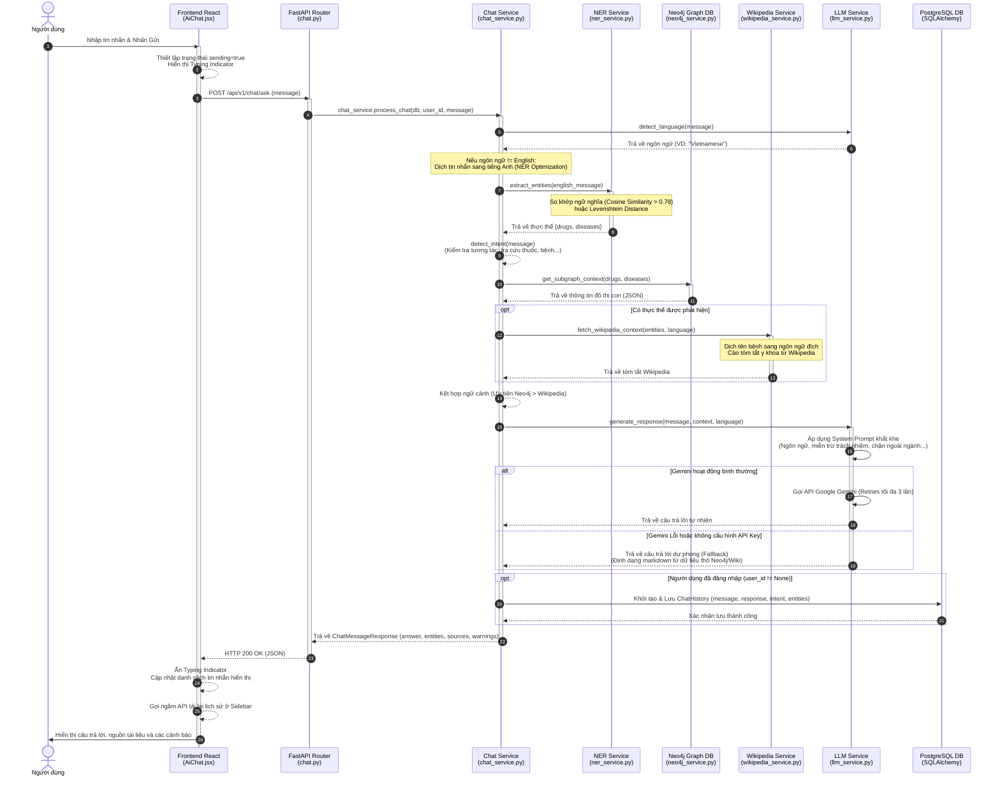
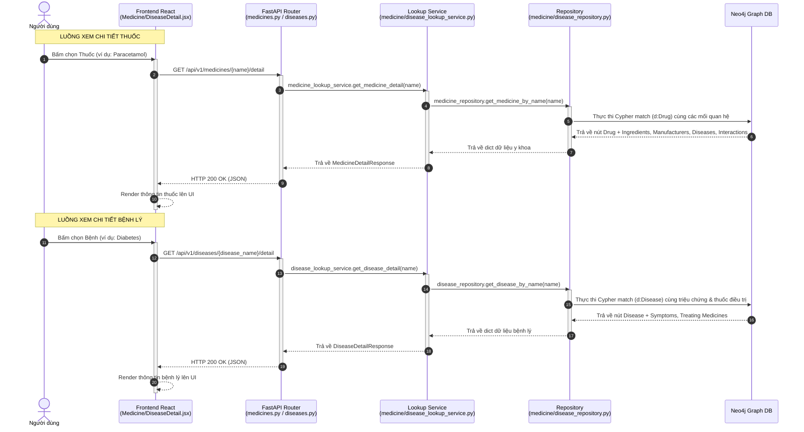

# 💬 LUỒNG XỬ LÝ CHAT & TRA CỨU Y KHOA (CHAT & MEDICAL LOOKUP PROCESSING FLOW)

Tài liệu này mô tả chi tiết luồng xử lý dữ liệu của hai chức năng cốt lõi trong hệ thống:
1. **Luồng Chat AI y tế (RAG)**: Từ khi nhập tin nhắn chat đến khi sinh phản hồi AI hoàn chỉnh.
2. **Luồng Tra cứu thông tin chi tiết**: Từ khi bấm xem chi tiết một loại thuốc hoặc bệnh lý đến khi dữ liệu đồ thị Neo4j được trích xuất và hiển thị lên giao diện.

---

## Ⅰ. LUỒNG XỬ LÝ TIN NHẮN CHAT (END-TO-END CHAT PROCESSING FLOW)

### 1. Tổng Quan Kiến Trúc
Hệ thống sử dụng mô hình **RAG (Retrieval-Augmented Generation)** để đảm bảo câu trả lời của AI luôn chính xác, dựa trên dữ liệu thực tế và hạn chế hiện tượng ảo giác (hallucination) của mô hình ngôn ngữ lớn (LLM).

Sự kết hợp công nghệ trong luồng xử lý:
* **Frontend (React)**: Nhận tin nhắn, hiển thị trạng thái đang xử lý và hiển thị câu trả lời (kèm nguồn, cảnh báo).
* **FastAPI (Backend)**: Tiếp nhận Request, phân quyền, quản lý DB Session và điều phối dịch vụ.
* **Language Detection & Translation**: Nhận diện ngôn ngữ và dịch câu hỏi sang tiếng Anh phục vụ trích xuất thực thể.
* **NER (spaCy + SentenceTransformer)**: Nhận diện và trích xuất thực thể y khoa (Thuốc, Bệnh lý).
* **Knowledge Graph (Neo4j)**: Truy vấn đồ thị con liên quan tới các thực thể để lấy ngữ cảnh y khoa chính xác.
* **Wikipedia API (Fallback Context)**: Tìm kiếm thông tin bổ sung nếu dữ liệu Neo4j chưa đầy đủ.
* **Google Gemini API (LLM)**: Tổng hợp ngữ cảnh và câu hỏi để đưa ra câu trả lời tự nhiên nhất theo quy tắc nghiệp vụ y tế.
* **Relational Database (PostgreSQL)**: Lưu lịch sử trò chuyện của người dùng đã đăng nhập.

### 2. Sơ Đồ Luồng Tuần Tự (Sequence Diagram - Chat Flow)



### 3. Chi Tiết Từng Bước Xử Lý
* **Bước 1: Giao Diện Frontend Gửi Tin Nhắn**: Người dùng nhập nội dung chat trên [AiChat.jsx](file:///d:/Baitap/C%C3%B4ng%20ngh%E1%BB%87%20ph%E1%BA%A7n%20m%E1%BB%81m/CongNghePhanMem/frontend/src/pages/AiChat.jsx), kích hoạt hoạt ảnh *"MediAI is thinking..."* và gọi hàm `sendMessage` để POST tin nhắn qua API `/api/v1/chat/ask`.
* **Bước 2: Endpoint Tiếp Nhận Request**: Router [chat.py](file:///d:/Baitap/C%C3%B4ng%20ngh%E1%BB%87%20ph%E1%BA%A7n%20m%E1%BB%81m/CongNghePhanMem/backend/app/api/v1/endpoints/chat.py) tiếp nhận dữ liệu, giải quyết phiên đăng nhập (nếu có) và database session, chuyển tiếp tới `chat_service.process_chat(...)`.
* **Bước 3: Nhận Diện Ngôn Ngữ & Dịch Thuật**: Hệ thống nhận diện ngôn ngữ trong [llm_service.py](file:///d:/Baitap/C%C3%B4ng%20ngh%E1%BB%87%20ph%E1%BA%A7n%20m%E1%BB%81m/CongNghePhanMem/backend/app/services/llm_service.py). Nếu không phải tiếng Anh, tin nhắn sẽ được dịch ngầm qua Google Translator phục vụ trích xuất thực thể.
* **Bước 4: Nhận Diện Thực Thể Y Khoa (NER)**: [ner_service.py](file:///d:/Baitap/C%C3%B4ng%20ngh%E1%BB%87%20ph%E1%BA%A7n%20m%E1%BB%81m/CongNghePhanMem/backend/app/services/ner_service.py) tự động nạp cache thuốc/bệnh lý từ Neo4j, trích xuất thực thể bằng so khớp ngữ nghĩa Cosine Similarity (ngưỡng 0.78) thông qua SentenceTransformer (`all-MiniLM-L6-v2`) hoặc Levenshtein Distance làm phương án dự phòng.
* **Bước 5: Nhận Diện Ý Định (Intent)**: `chat_service.py` phân tích ý định dựa trên từ khóa y khoa thông dụng (`interaction_check`, `drug_info`, `disease_info`, `general_query`).
* **Bước 6: Truy Xuất Ngữ Cảnh Y Tế**: Lấy dữ liệu đồ thị con bằng hàm `get_subgraph_context` trong [neo4j_service.py](file:///d:/Baitap/C%C3%B4ng%20ngh%E1%BB%87%20ph%E1%BA%A7n%20m%E1%BB%81m/CongNghePhanMem/backend/app/services/neo4j_service.py) (chỉ định thuốc, tương tác, triệu chứng...). Lấy tóm tắt định nghĩa bổ sung bằng `wikipedia_service.py`.
* **Bước 7: AI Tạo Phản Hồi**: Gửi ngữ cảnh tích hợp lên Google Gemini API với system prompt quy định nghiêm ngặt về ngôn ngữ, miễn trừ trách nhiệm y tế và chặn các câu hỏi ngoài luồng. Nếu Gemini lỗi, hệ thống tự định dạng dữ liệu thô thành markdown dễ đọc cho người dùng.
* **Bước 8: Lưu Lịch Sử Trò Chuyện**: Tạo bản ghi `ChatHistory` và lưu vào PostgreSQL.
* **Bước 9: Phản Hồi & Hiển Thị UI**: Trả về dữ liệu cho Frontend, cập nhật UI và làm mới lịch sử chat ở thanh Sidebar.

### 4. Sơ Đồ Cơ Chế Dự Phòng (Fallback Decision Tree - Chat Flow)
```
                  [ Người dùng hỏi ]
                           │
                           ▼
               [ Nhận diện thực thể? ]
               /                   \
            (Có)                  (Không)
             /                       \
    [ Truy vấn Neo4j ]          [ Bỏ qua Neo4j ]
           │                           │
  (Có dữ liệu đồ thị?)                 │
    /            \                     │
 (Có)          (Không)                 │
  /                \                   ▼
[Gán làm context] [Gọi Wikipedia API] ──→ [Context trống]
       │                 │                     │
       │         (Có thông tin?)               │
       │          /          \                 │
       │       (Có)        (Không)             │
       │        /              \               │
       │  [Gán làm context]  [Context trống]   │
       ▼        ▼              ▼               ▼
     [ Gộp ngữ cảnh chính và ngữ cảnh phụ ]
                           │
                           ▼
                 [ Gọi Google Gemini ]
                 /                   \
           (Thành công)            (Thất bại)
               /                       \
      [ Trả về câu trả lời ]     [ Kích hoạt Fallback ]
      [ mượt mà từ Gemini ]      [ Tự định dạng dữ liệu ]
                                 [ thô trong Context ]
                                 [ thành Markdown dễ đọc]
```

---

## Ⅱ. LUỒNG TRA CỨU THÔNG TIN THUỐC / BỆNH LÝ (MEDICINE & DISEASE LOOKUP FLOW)

Khi người dùng nhấn vào một loại thuốc hoặc bệnh lý trên hệ thống để xem chi tiết, ứng dụng sẽ thực hiện truy vấn trực tiếp cơ sở dữ liệu đồ thị Neo4j để tái dựng toàn bộ hồ sơ y khoa liên quan.

### 1. Sơ Đồ Luồng Tuần Tự (Sequence Diagram - Detail Lookup)



### 2. Chi Tiết Luồng Tra Cứu Thuốc (Medicine Detail Flow)

#### Bước 1: Kích hoạt tại Frontend (Trigger)
* **Tệp nguồn**: [MedicineDetail.jsx](file:///d:/Baitap/C%C3%B4ng%20ngh%E1%BB%87%20ph%E1%BA%A7n%20m%E1%BB%81m/CongNghePhanMem/frontend/src/pages/MedicineDetail.jsx)
* **Xử lý**:
  1. Khi component mount, lấy tham số `id` (chứa tên thuốc, ví dụ: `aspirin`) từ URL thông qua `useParams()`.
  2. Bắt đầu lệnh gọi API: `MedicinesService.getMedicineDetailApiV1MedicinesNameDetailGet({ name: id })`.
  3. Kiểm tra bookmark (nếu người dùng đăng nhập): Gọi API `BookmarksService.getBookmarksApiV1BookmarksGet` để xem ID của thuốc đã được bookmark trong PostgreSQL chưa.

#### Bước 2: Nhận yêu cầu tại API Endpoint (FastAPI)
* **Tệp nguồn**: [medicines.py](file:///d:/Baitap/C%C3%B4ng%20ngh%E1%BB%87%20ph%E1%BA%A7n%20m%E1%BB%81m/CongNghePhanMem/backend/app/api/v1/endpoints/medicines.py)
* **Xử lý**:
  1. Endpoint `GET /api/v1/medicines/{name}/detail` tiếp nhận tham số `name`.
  2. Gọi phương thức logic: `medicine_lookup_service.get_medicine_detail(name)`.

#### Bước 3: Nghiệp vụ Service & Truy vấn Repository (Neo4j)
* **Tệp nguồn**: [medicine_lookup_service.py](file:///d:/Baitap/C%C3%B4ng%20ngh%E1%BB%87%20ph%E1%BA%A7n%20m%E1%BB%81m/CongNghePhanMem/backend/app/services/medicine_lookup_service.py) và [medicine_repository.py](file:///d:/Baitap/C%C3%B4ng%20ngh%E1%BB%87%20ph%E1%BA%A7n%20m%E1%BB%81m/CongNghePhanMem/backend/app/repositories/medicine_repository.py)
* **Xử lý**:
  1. Service chuyển tiếp cuộc gọi tới repository: `medicine_repository.get_medicine_by_name(name)`.
  2. Repository thực thi câu lệnh Cypher tối ưu trên cơ sở dữ liệu đồ thị Neo4j:
     ```cypher
     MATCH (m:Drug)
     WHERE toLower(trim(m.name)) = toLower(trim($name))
        OR toLower(trim(coalesce(m.brand_name, ""))) = toLower(trim($name))
        OR toLower(trim(coalesce(m.generic_name, ""))) = toLower(trim($name))
     RETURN 
         m.name AS name,
         m.brand_name AS brand_name,
         m.generic_name AS generic_name,
         m.manufacturer AS manufacturer,
         m.purpose AS purpose,
         m.indications AS indications,
         m.warnings AS warnings,
         m.dosage AS dosage,
         m.contraindications AS contraindications,
         m.adverse_reactions AS adverse_reactions,
         m.updated_at AS updated_at,
         [(m)-[:CONTAINS]->(i:Ingredient) | i.name] AS ingredients,
         [(m)-[:MADE_BY]->(man:Manufacturer) | man.name] AS manufacturers,
         [(m)-[:TREATS]->(dis:Disease) | dis.name] AS treated_diseases,
         [(m)-[int:INTERACTS_WITH]-(m2:Drug) | {
             name: m2.name,
             severity: int.severity,
             description: int.description
         }] AS interactions
     ```
  3. Cú pháp Comprehension List `[(m)-[:RELATION]->(x) | x.property]` được sử dụng để lấy toàn bộ danh sách thành phần hoạt chất, nhà sản xuất, bệnh lý điều trị, và các loại thuốc tương tác kèm mức độ nghiêm trọng chỉ trong **1 câu truy vấn đồ thị duy nhất**.
  4. Trả về đối tượng kiểu từ điển hoặc raise lỗi `HTTPException 404` nếu không tìm thấy.

#### Bước 4: Hiển thị giao diện & Chuyển hướng hỏi AI
* **Xử lý**:
  1. Frontend React nhận kết quả JSON chứa đầy đủ thông tin thuốc.
  2. Render các phần: Tên thương mại/tên gốc, thành phần hoạt chất, liều lượng chỉ định, các phản ứng phụ/tác dụng phụ nguy hiểm.
  3. Hiển thị khung cảnh báo tương tác thuốc nổi bật (Major/Moderate) và danh sách các thuốc xung đột.
  4. Cung cấp nút **"Ask AI about this"**: Nếu người dùng muốn phân tích sâu, khi click nút này, ứng dụng sẽ chuyển hướng sang trang chat (`/app/chat` hoặc `/chat`) kèm state:
     ```javascript
     navigate('/app/chat', { state: { q: `Tell me detailed information about the medicine ${medicine.name}` } })
     ```
     Trang chat sẽ tự động điền câu hỏi này và thực hiện gửi lệnh chat AI.

---

### 3. Chi Tiết Luồng Tra Cứu Bệnh Lý (Disease Detail Flow)

#### Bước 1: Kích hoạt tại Frontend (Trigger)
* **Tệp nguồn**: [DiseaseDetail.jsx](file:///d:/Baitap/C%C3%B4ng%20ngh%E1%BB%87%20ph%E1%BA%A7n%20m%E1%BB%81m/CongNghePhanMem/frontend/src/pages/DiseaseDetail.jsx)
* **Xử lý**:
  1. Lấy tên bệnh lý từ URL parameter `id` (ví dụ: `diabetes`).
  2. Bắt đầu gọi API: `DiseasesService.getDiseaseDetailApiV1DiseasesDiseaseNameDetailGet({ diseaseName: id })`.

#### Bước 2: Nhận yêu cầu tại API Endpoint (FastAPI)
* **Tệp nguồn**: [diseases.py](file:///d:/Baitap/C%C3%B4ng%20ngh%E1%BB%87%20ph%E1%BA%A7n%20m%E1%BB%81m/CongNghePhanMem/backend/app/api/v1/endpoints/diseases.py)
* **Xử lý**:
  1. Endpoint `GET /api/v1/diseases/{disease_name}/detail` tiếp nhận tham số `disease_name`.
  2. Gọi phương thức logic: `disease_lookup_service.get_disease_detail(disease_name)`.

#### Bước 3: Nghiệp vụ Service & Truy vấn Repository (Neo4j)
* **Tệp nguồn**: [disease_lookup_service.py](file:///d:/Baitap/C%C3%B4ng%20ngh%E1%BB%87%20ph%E1%BA%A7n%20m%E1%BB%81m/CongNghePhanMem/backend/app/services/disease_lookup_service.py) và [disease_repository.py](file:///d:/Baitap/C%C3%B4ng%20ngh%E1%BB%87%20ph%E1%BA%A7n%20m%E1%BB%81m/CongNghePhanMem/backend/app/repositories/disease_repository.py)
* **Xử lý**:
  1. Service chuyển tiếp cuộc gọi tới repository: `disease_repository.get_disease_by_name(disease_name)`.
  2. Repository thực thi câu lệnh Cypher truy vấn Neo4j:
     ```cypher
     MATCH (d:Disease {name: $name})
     OPTIONAL MATCH (m:Drug)-[:TREATS]->(d)
     OPTIONAL MATCH (d)-[:HAS_SYMPTOM|RELATED_TO]->(s:Symptom)
     RETURN 
         d.name AS name,
         d.description AS description,
         d.icd_code AS icd_code,
         d.category AS category,
         d.severity AS severity,
         d.updated_at AS updated_at,
         collect(DISTINCT m.name) AS treating_medicines,
         collect(DISTINCT {name: s.name, description: s.description}) AS symptoms
     ```
  3. Lệnh này tìm kiếm nút `Disease` có tên chỉ định, đồng thời quét các mối liên kết `TREATS` từ các thuốc và mối liên kết `HAS_SYMPTOM` hoặc `RELATED_TO` tới các triệu chứng. Dữ liệu được gom nhóm thông qua lệnh `collect(DISTINCT ...)`.
  4. Kết quả được ánh xạ sang schema Pydantic `DiseaseDetailResponse` rồi trả về API.

#### Bước 4: Hiển thị giao diện & Chuyển hướng hỏi AI
* **Xử lý**:
  1. Frontend React nhận thông tin chi tiết bệnh lý dưới dạng JSON.
  2. Render các phần: Tên bệnh, mô tả bệnh, các dấu hiệu khẩn cấp, các triệu chứng phổ biến.
  3. Hiển thị danh sách thuốc khuyên dùng (Recommended Medicines) và các bệnh lý liên quan.
  4. Cung cấp nút Floating Action Button (FAB) **"Ask AI Assistant"**: Nút này nổi ở góc màn hình, khi click sẽ chuyển sang trang chat AI kèm câu hỏi tự động được dựng sẵn:
     ```javascript
     navigate('/app/chat', { state: { q: `Tell me about the condition: ${disease.name}. What are the symptoms and treatments?` } })
     ```
     AI sẽ đọc câu hỏi này, trích xuất thực thể, lấy context từ Neo4j và tổng hợp câu trả lời y khoa tối ưu.

---

## 📂 CÁC TỆP NGUỒN LIÊN QUAN TRONG DỰ ÁN

* **Giao diện người dùng (React)**:
  * [AiChat.jsx](file:///d:/Baitap/C%C3%B4ng%20ngh%E1%BB%87%20ph%E1%BA%A7n%20m%E1%BB%81m/CongNghePhanMem/frontend/src/pages/AiChat.jsx) - Giao diện Chat AI và hiển thị thông báo.
  * [MedicineDetail.jsx](file:///d:/Baitap/C%C3%B4ng%20ngh%E1%BB%87%20ph%E1%BA%A7n%20m%E1%BB%81m/CongNghePhanMem/frontend/src/pages/MedicineDetail.jsx) - Giao diện chi tiết của Thuốc, hiển thị hoạt chất, liều lượng, tương tác thuốc.
  * [DiseaseDetail.jsx](file:///d:/Baitap/C%C3%B4ng%20ngh%E1%BB%87%20ph%E1%BA%A7n%20m%E1%BB%81m/CongNghePhanMem/frontend/src/pages/DiseaseDetail.jsx) - Giao diện chi tiết của Bệnh, hiển thị triệu chứng, thuốc khuyên dùng và nút FAB gọi AI.
* **API Controllers**:
  * [chat.py](file:///d:/Baitap/C%C3%B4ng%20ngh%E1%BB%87%20ph%E1%BA%A7n%20m%E1%BB%81m/CongNghePhanMem/backend/app/api/v1/endpoints/chat.py) - Endpoint `/ask` xử lý tin nhắn chat.
  * [medicines.py](file:///d:/Baitap/C%C3%B4ng%20ngh%E1%BB%87%20ph%E1%BA%A7n%20m%E1%BB%81m/CongNghePhanMem/backend/app/api/v1/endpoints/medicines.py) - API `/medicines/{name}/detail` phục vụ tra cứu thuốc.
  * [diseases.py](file:///d:/Baitap/C%C3%B4ng%20ngh%E1%BB%87%20ph%E1%BA%A7n%20m%E1%BB%81m/CongNghePhanMem/backend/app/api/v1/endpoints/diseases.py) - API `/diseases/{disease_name}/detail` phục vụ tra cứu bệnh.
* **Tầng Services**:
  * [chat_service.py](file:///d:/Baitap/C%C3%B4ng%20ngh%E1%BB%87%20ph%E1%BA%A7n%20m%E1%BB%81m/CongNghePhanMem/backend/app/services/chat_service.py) - Điều phối RAG tổng hợp.
  * [medicine_lookup_service.py](file:///d:/Baitap/C%C3%B4ng%20ngh%E1%BB%87%20ph%E1%BA%A7n%20m%E1%BB%81m/CongNghePhanMem/backend/app/services/medicine_lookup_service.py) - Logic điều hướng truy xuất thuốc.
  * [disease_lookup_service.py](file:///d:/Baitap/C%C3%B4ng%20ngh%E1%BB%87%20ph%E1%BA%A7n%20m%E1%BB%81m/CongNghePhanMem/backend/app/services/disease_lookup_service.py) - Logic điều hướng truy xuất bệnh lý.
  * [llm_service.py](file:///d:/Baitap/C%C3%B4ng%20ngh%E1%BB%87%20ph%E1%BA%A7n%20m%E1%BB%81m/CongNghePhanMem/backend/app/services/llm_service.py) - Gọi Gemini và quản lý system prompt / fallback.
  * [ner_service.py](file:///d:/Baitap/C%C3%B4ng%20ngh%E1%BB%87%20ph%E1%BA%A7n%20m%E1%BB%81m/CongNghePhanMem/backend/app/services/ner_service.py) - Nhận diện thực thể.
* **Tầng Repositories (Neo4j)**:
  * [medicine_repository.py](file:///d:/Baitap/C%C3%B4ng%20ngh%E1%BB%87%20ph%E1%BA%A7n%20m%E1%BB%81m/CongNghePhanMem/backend/app/repositories/medicine_repository.py) - Truy vấn Cypher lấy dữ liệu thuốc.
  * [disease_repository.py](file:///d:/Baitap/C%C3%B4ng%20ngh%E1%BB%87%20ph%E1%BA%A7n%20m%E1%BB%81m/CongNghePhanMem/backend/app/repositories/disease_repository.py) - Truy vấn Cypher lấy dữ liệu bệnh lý.
  * [neo4j_repository.py](file:///d:/Baitap/C%C3%B4ng%20ngh%E1%BB%87%20ph%E1%BA%A7n%20m%E1%BB%81m/CongNghePhanMem/backend/app/repositories/neo4j_repository.py) - Trình quản lý session kết nối Bolt driver đến Neo4j.
