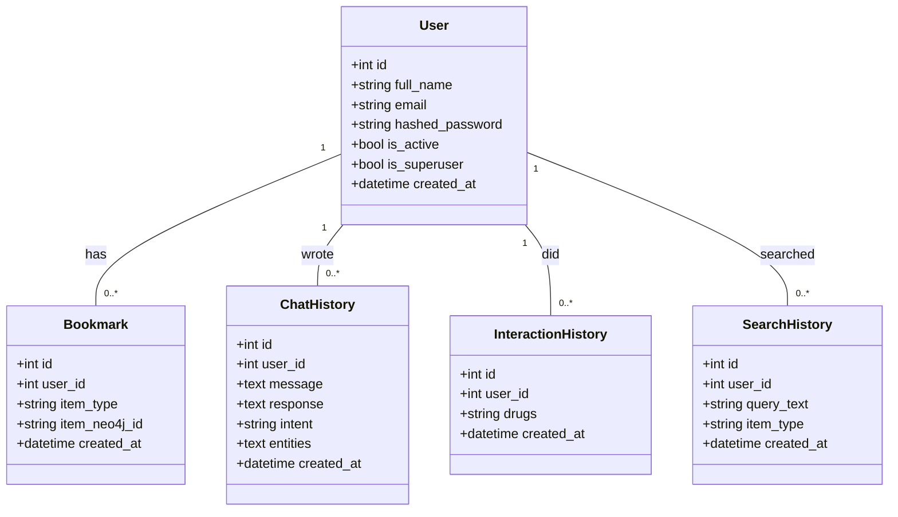
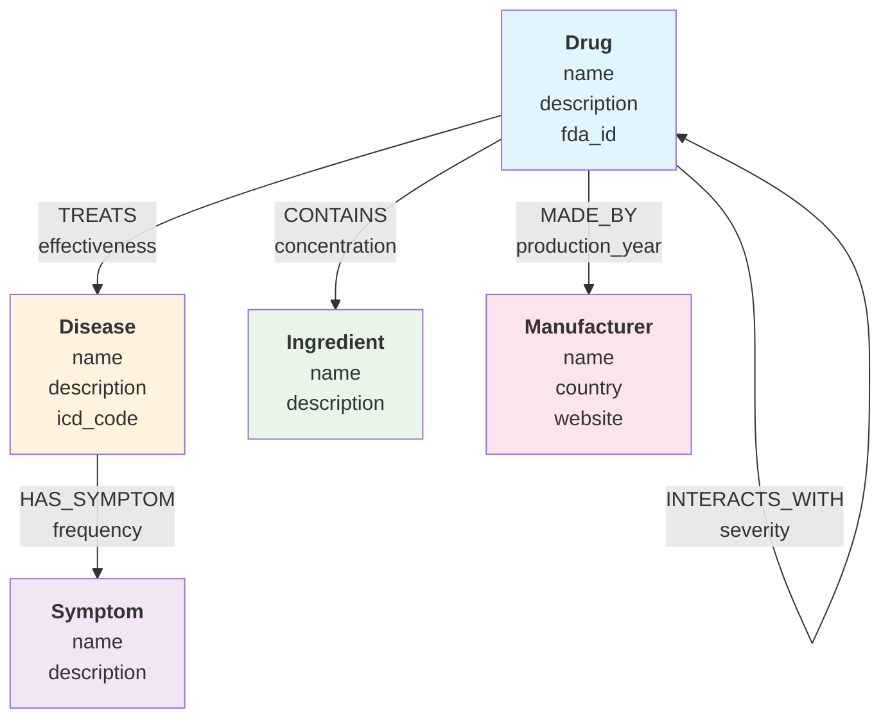

# Class Diagram (Relational models)

Sơ đồ lớp cho các model SQLAlchemy trong `backend/app/models`.

---

## Neo4j Graph Model

Sơ đồ các node và quan hệ trong Neo4j graph database.

---

## Chi tiết cấu trúc Neo4j

Xem file [NEO4J_GRAPH_STRUCTURE.md](./NEO4J_GRAPH_STRUCTURE.md) để hiểu rõ:
- Các node type và properties
- Các relationship type
- Ví dụ query Cypher
- Cách nạp dữ liệu từ CSV
