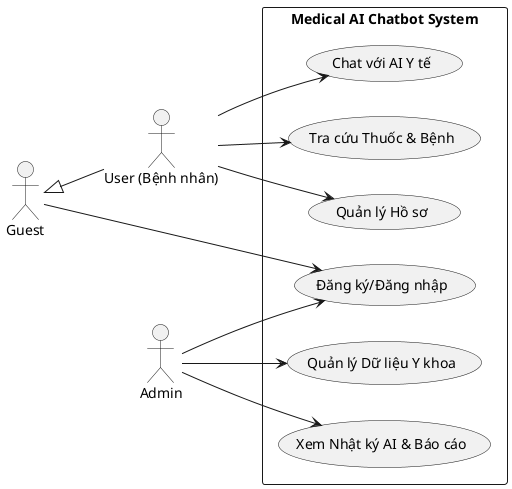
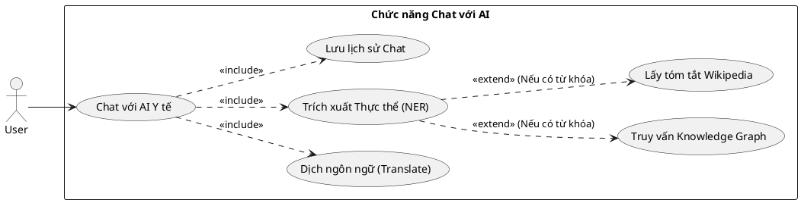
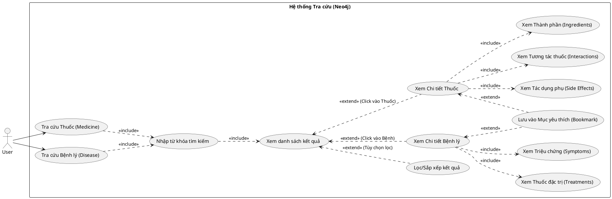
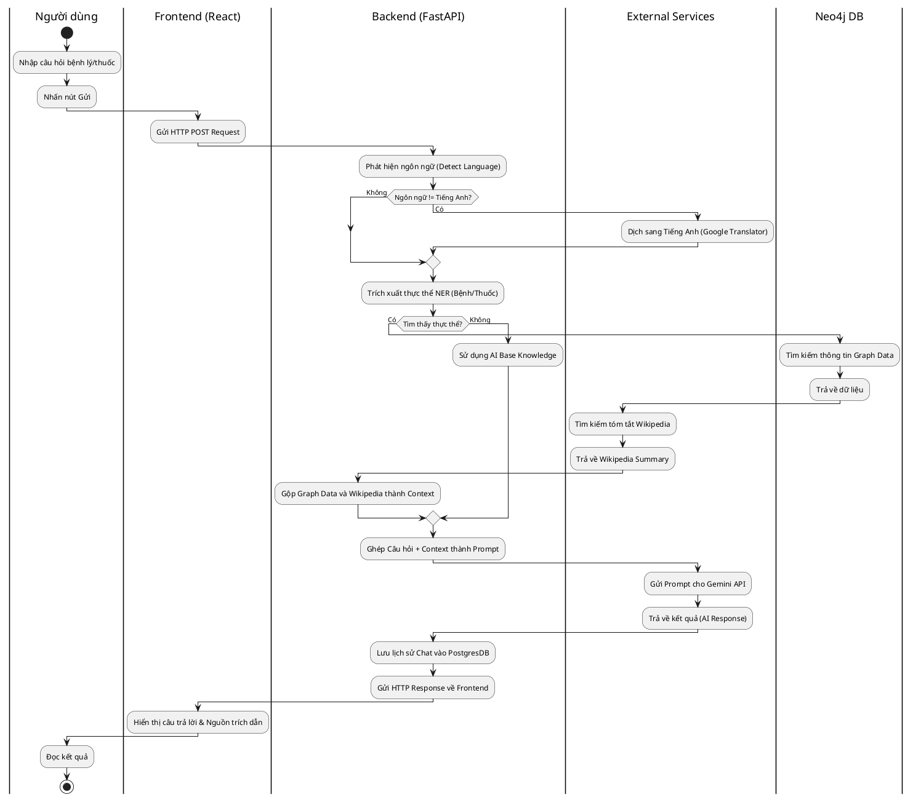
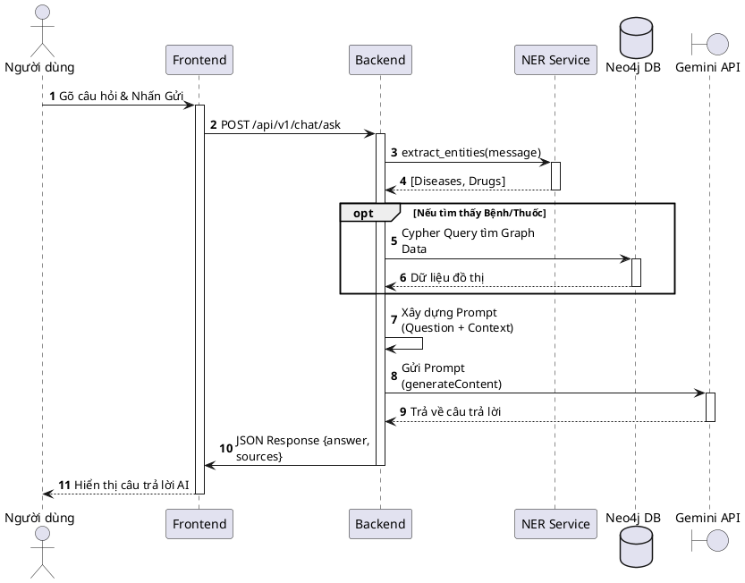
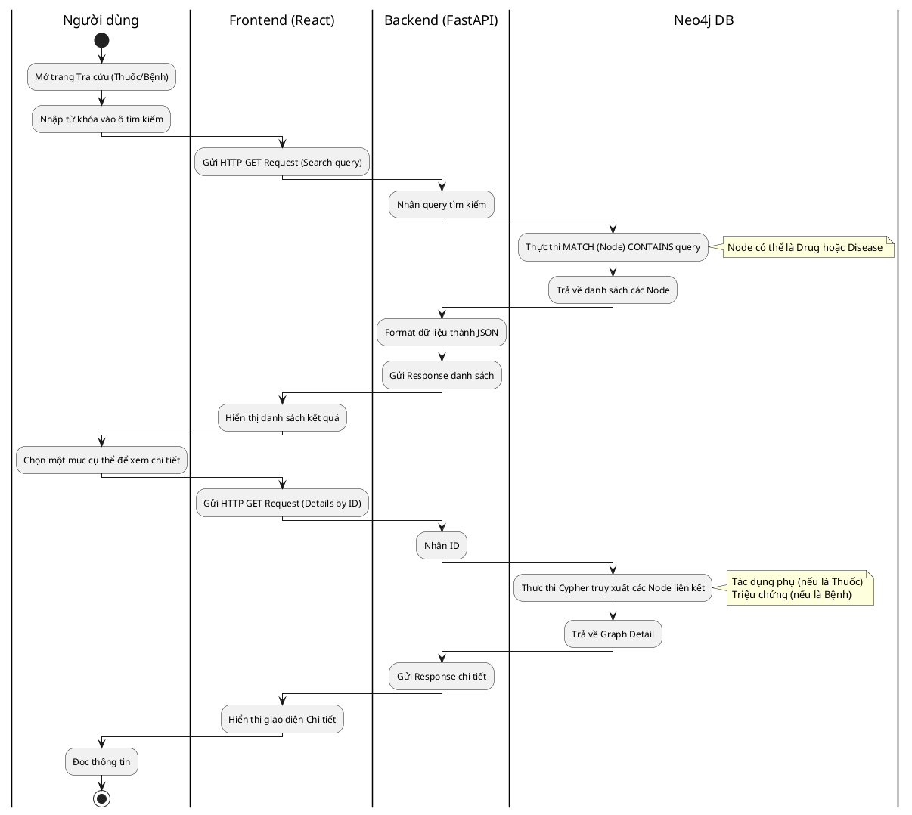
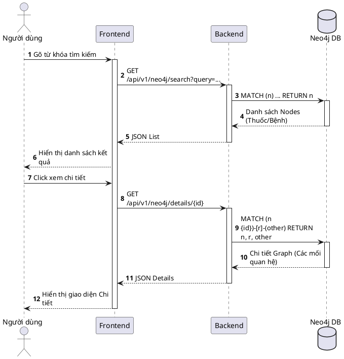
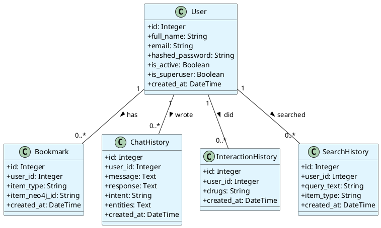
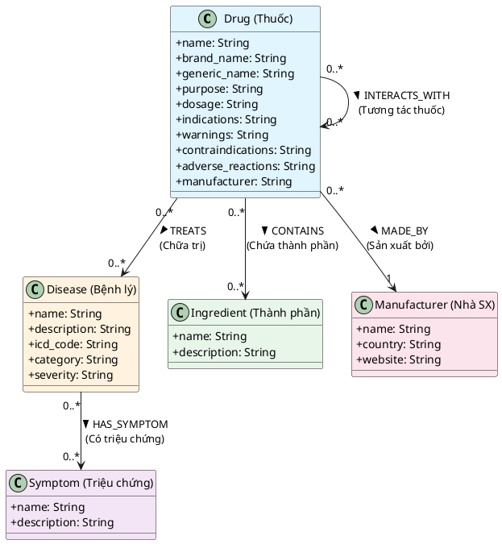

# BỘ UML DIAGRAMS CHO HỆ THỐNG MEDICAL CHATBOT

Dưới đây là bộ UML hoàn chỉnh bao gồm các Use Case (Tổng quan & Phân rã), cùng với Activity Diagram (có Swimlane) và Sequence Diagram cho các chức năng cốt lõi.

---

## PHẦN 1: USE CASE DIAGRAM

### 1.1. Use Case Tổng Quan (Overall System)

### 1.2. Use Case Phân rã: Quá trình Chat với AI

### 1.3. Use Case Phân rã: Quá trình Tra cứu (Thuốc & Bệnh lý)

---

## PHẦN 2: QUÁ TRÌNH CHAT VỚI AI

### 2.1. Activity Diagram (Có Swimlane)

### 2.2. Sequence Diagram

---

## PHẦN 3: QUÁ TRÌNH TRA CỨU THÔNG TIN Y KHOA (Thuốc & Bệnh)
*(Để tránh lặp lại, sơ đồ này bao quát chung cho luồng tìm kiếm và xem chi tiết của cả Thuốc và Bệnh do kiến trúc xử lý tương đồng nhau)*

### 3.1. Activity Diagram (Có Swimlane)

### 3.2. Sequence Diagram

---

## PHẦN 4: CLASS DIAGRAM (Sơ đồ Lớp & Sơ đồ Đồ thị)

Dưới đây là sơ đồ cấu trúc cơ sở dữ liệu của toàn bộ hệ thống, được chia làm 2 phần: Dữ liệu quan hệ (PostgreSQL) để quản lý người dùng và Dữ liệu đồ thị (Neo4j) để lưu trữ kiến thức y khoa.

### 4.1. Sơ đồ Lớp Quan hệ (PostgreSQL Models)
Quản lý tài khoản, lịch sử tra cứu và lịch sử trò chuyện của người dùng.

### 4.2. Sơ đồ Đồ thị Tri thức (Neo4j Graph Models)
Lưu trữ thông tin chuyên sâu về Thuốc, Bệnh lý và các mối quan hệ y khoa.

