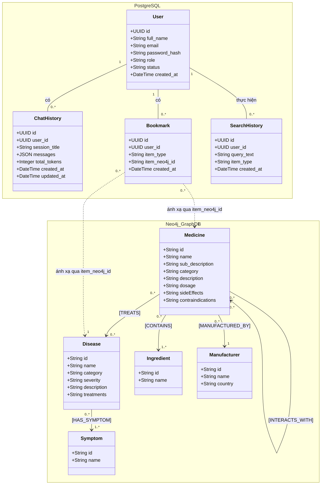

# MEDICHAT CLASS DIAGRAM

Dưới đây là Sơ đồ lớp (Class Diagram) thể hiện cấu trúc các thực thể và mối quan hệ giữa chúng, được phân chia theo 2 hệ quản trị cơ sở dữ liệu (PostgreSQL và Neo4j) dựa trên kiến trúc của hệ thống.

